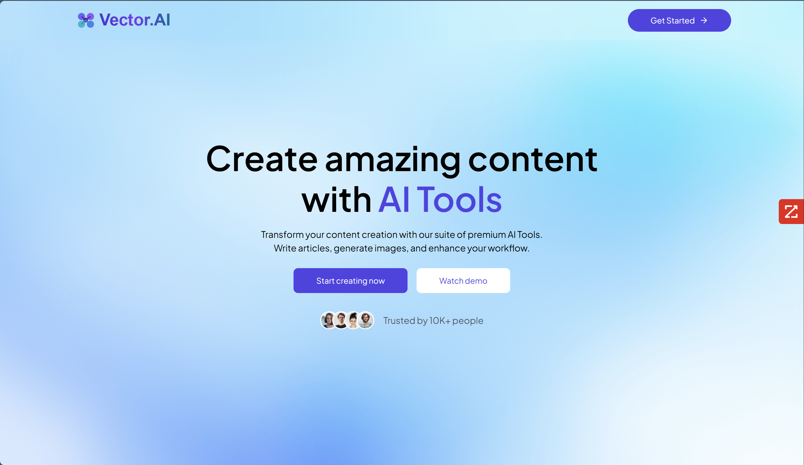
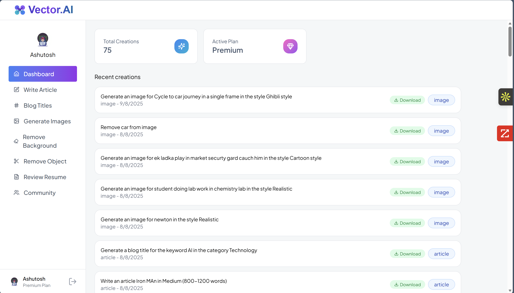

# 🚀 Vector.AI - AI-Powered Content Creation Platform

<div align="center">

  **A comprehensive full-stack AI SaaS application that empowers users to create content, generate images, and enhance their digital assets using cutting-edge artificial intelligence.**

  [🌐 **Live Demo**](https://vectorai.aashutosh.me/) • [📖 **Documentation**](#-table-of-contents) • [🚀 **Quick Start**](#-quick-start) • [🤝 **Contributing**](#-contributing)

</div>

---

## 📸 Screenshots

<div align="center">
  
  
</div>

## 🎯 Features

> **Transform your content creation workflow with AI-powered tools**

### 🎯 Core AI Tools
- **AI Article Writer**: Generate high-quality, engaging articles with customizable length (500-1600+ words)
- **Blog Title Generator**: Create catchy and SEO-optimized titles across 8 different categories
- **AI Image Generation**: Produce stunning images from text prompts with 8+ artistic styles
- **Background Removal**: Automatically remove backgrounds from images using AI
- **Object Removal**: Seamlessly erase unwanted objects from photos
- **Resume Reviewer**: Get AI-driven feedback and suggestions to improve your resume

### 👥 User Experience
- **Authentication**: Secure user management with Clerk
- **Dashboard**: Personal workspace to view all your AI creations
- **Community Gallery**: Share and discover AI-generated content from other users
- **Like System**: Engage with community content through likes
- **Usage Plans**: Free tier with limits + Premium unlimited access

### 🔧 Technical Features
- **Responsive Design**: Mobile-first approach with Tailwind CSS
- **Real-time Feedback**: Toast notifications for all user actions
- **File Upload**: Secure image and PDF upload functionality (5MB limit)
- **Content Management**: Publish/unpublish your creations
- **Database Persistence**: All creations are stored and retrievable
- **Download Functionality**: Download all generated content (images as PNG, text as TXT)
- **Loading Animations**: Beautiful animated loading states during processing
- **Error Handling**: Comprehensive error handling with user-friendly messages
- **Rate Limiting**: Built-in API rate limiting and usage tracking

## 🛠 Tech Stack

### Frontend
- **React 19** - Modern UI library
- **Vite** - Fast build tool and development server
- **React Router DOM** - Client-side routing
- **Tailwind CSS** - Utility-first CSS framework
- **Axios** - HTTP client for API requests
- **Lucide React** - Beautiful icon library
- **React Hot Toast** - Elegant notifications
- **React Markdown** - Markdown rendering
- **Clerk** - Authentication and user management

### Backend
- **Node.js** - Runtime environment
- **Express.js** - Web application framework
- **PostgreSQL** - Primary database (via Neon)
- **Clerk Express** - Authentication middleware
- **Cloudinary** - Image storage and processing
- **Multer** - File upload handling
- **OpenAI API** - AI text generation (via Gemini)
- **ClipDrop API** - AI image generation
- **PDF Parse** - Resume processing

### Database & Storage
- **Neon PostgreSQL** - Serverless PostgreSQL database
- **Cloudinary** - Cloud-based image and video management

## 🚀 Quick Start

Get Vector.AI running in under 5 minutes:

```bash
# 1. Clone the repository
git clone https://github.com/aashutosh585/Vector.AI.git
cd Vector.AI

# 2. Install dependencies (both client and server)
npm run install:all

# 3. Set up environment variables (see .env.example files)
cp client/.env.example client/.env
cp server/.env.example server/.env

# 4. Start development servers
npm run dev
```

Open [http://localhost:5173](http://localhost:5173) to see the application.

> **⚡ Quick Note**: You'll need API keys for Clerk, OpenAI/Gemini, ClipDrop, and Cloudinary. See the [Environment Variables](#-environment-variables) section for details.

## 📁 Project Structure

```
AI SaaS/
├── client/                     # Frontend React application
│   ├── public/                 # Static assets
│   ├── src/
│   │   ├── assets/            # Images, icons, and data
│   │   ├── components/        # Reusable UI components
│   │   │   ├── AiTools.jsx    # AI tools showcase
│   │   │   ├── CreationItem.jsx # Individual creation display
│   │   │   ├── Footer.jsx     # Site footer
│   │   │   ├── Hero.jsx       # Landing page hero
│   │   │   ├── Navbar.jsx     # Navigation bar
│   │   │   ├── Plan.jsx       # Pricing plans
│   │   │   ├── Sidebar.jsx    # Dashboard sidebar
│   │   │   └── Testimonial.jsx # User testimonials
│   │   ├── pages/             # Application pages
│   │   │   ├── BlogTitles.jsx # Blog title generator
│   │   │   ├── Community.jsx  # Community gallery
│   │   │   ├── DashBoard.jsx  # User dashboard
│   │   │   ├── GenerateImages.jsx # Image generation
│   │   │   ├── Home.jsx       # Landing page
│   │   │   ├── Layout.jsx     # App layout wrapper
│   │   │   ├── RemoveBackground.jsx # Background removal
│   │   │   ├── RemoveObject.jsx # Object removal
│   │   │   ├── ReviewResume.jsx # Resume review
│   │   │   └── WriteArticle.jsx # Article generation
│   │   ├── App.jsx            # Main app component
│   │   ├── index.css          # Global styles
│   │   └── main.jsx           # App entry point
│   ├── .env                   # Environment variables
│   ├── package.json           # Dependencies and scripts
│   └── vite.config.js         # Vite configuration
├── server/                     # Backend Express application
│   ├── configs/               # Configuration files
│   │   ├── cloudinary.js      # Cloudinary setup
│   │   ├── db.js              # Database connection
│   │   └── multer.js          # File upload config
│   ├── controllers/           # Route controllers
│   │   ├── aiController.js    # AI-related endpoints
│   │   └── userController.js  # User-related endpoints
│   ├── middlewares/           # Custom middleware
│   │   └── auth.js            # Authentication middleware
│   ├── routes/                # API routes
│   │   ├── aiRoutes.js        # AI endpoints routing
│   │   └── userRoutes.js      # User endpoints routing
│   ├── package.json           # Dependencies and scripts
│   └── server.js              # Express server setup
└── README.md                   # Project documentation
```

## 📋 Prerequisites

Before running this application, make sure you have:

### 🔧 Development Environment
- **Node.js** (v18 or higher) - [Download](https://nodejs.org/)
- **npm** or **yarn** - Package manager
- **Git** - Version control

### 🔑 Required Services & API Keys
- **Clerk Account** - [Sign up](https://clerk.com/) for authentication
- **Neon Database** - [Create account](https://neon.tech/) for PostgreSQL
- **Cloudinary Account** - [Sign up](https://cloudinary.com/) for image storage
- **OpenAI/Gemini API Key** - [Get API key](https://platform.openai.com/) for text generation
- **ClipDrop API Key** - [Get API key](https://clipdrop.co/apis) for image generation

### 📱 Optional
- **Vercel Account** - For deployment
- **VS Code** - Recommended editor with extensions:
  - ES7+ React/Redux/React-Native snippets
  - Tailwind CSS IntelliSense
  - Prettier - Code formatter

## ⚙️ Installation

### Method 1: Automatic Setup (Recommended)

```bash
# Clone the repository
git clone https://github.com/aashutosh585/Vector.AI.git
cd Vector.AI

# Run automatic setup script
npm run setup
```

### Method 2: Manual Installation

#### 1. Clone the Repository
```bash
git clone https://github.com/aashutosh585/Vector.AI.git
cd Vector.AI
```

#### 2. Install Dependencies
```bash
# Install root dependencies
npm install

# Install client dependencies
cd client
npm install

# Install server dependencies
cd ../server
npm install
```

#### 3. Database Setup
```bash
# Create database tables (run from server directory)
cd server
npm run db:setup
```

## 🔐 Environment Variables

### Frontend (.env)

Create a `.env` file in the `client` directory:

```env
VITE_CLERK_PUBLISHABLE_KEY=your_clerk_publishable_key
VITE_BASE_URL=http://localhost:3000
```

### Backend (.env)

Create a `.env` file in the `server` directory:

```env
# Database
DATABASE_URL=your_neon_postgresql_connection_string

# Authentication
CLERK_SECRET_KEY=your_clerk_secret_key
CLERK_WEBHOOK_SECRET=your_clerk_webhook_secret

# AI Services
GEMINI_API_KEY=your_gemini_api_key
CLIPDROP_API_KEY=your_clipdrop_api_key

# Cloud Storage
CLOUDINARY_CLOUD_NAME=your_cloudinary_cloud_name
CLOUDINARY_API_KEY=your_cloudinary_api_key
CLOUDINARY_API_SECRET=your_cloudinary_api_secret

# Server
PORT=3000
NODE_ENV=development
```

## 🏃‍♂️ Usage

### Development Mode

1. **Start the Backend Server**:
```bash
cd server
npm run server
```

2. **Start the Frontend Development Server**:
```bash
cd client
npm run dev
```

3. **Access the Application**:
   - Frontend: `http://localhost:5173`
   - Backend API: `http://localhost:3000`

### Production Mode

1. **Build the Frontend**:
```bash
cd client
npm run build
```

2. **Start the Production Server**:
```bash
cd server
npm start
```

## � API Documentation

### 🤖 AI Endpoints (`/api/ai`)

| Method | Endpoint | Description | Parameters | Response | Auth |
|--------|----------|-------------|------------|----------|------|
| POST | `/generate-article` | Generate articles with custom length | `prompt`, `length` | `{success, content}` | ✅ |
| POST | `/generate-blog-title` | Create blog titles by category | `prompt` | `{success, content}` | ✅ |
| POST | `/generate-images` | Generate images from text prompts | `prompt`, `publish` | `{success, content}` | ✅ |
| POST | `/remove-background` | Remove image backgrounds | `image` (file) | `{success, content}` | ✅ |
| POST | `/remove-image-object` | Remove objects from images | `image` (file), `object` | `{success, content}` | ✅ |
| POST | `/resume-review` | Analyze and review resumes | `resume` (PDF file) | `{success, content}` | ✅ |

### 👤 User Endpoints (`/api/user`)

| Method | Endpoint | Description | Parameters | Response | Auth |
|--------|----------|-------------|------------|----------|------|
| GET | `/get-user-creations` | Fetch user's all creations | - | `{success, creations[]}` | ✅ |
| GET | `/get-published-creations` | Fetch public community creations | - | `{success, creations[]}` | ✅ |
| POST | `/toggle-like-creation` | Like/unlike community creations | `id` | `{success, message}` | ✅ |

### 📝 Example API Usage

```javascript
// Generate an article
const response = await fetch('/api/ai/generate-article', {
  method: 'POST',
  headers: {
    'Authorization': `Bearer ${token}`,
    'Content-Type': 'application/json'
  },
  body: JSON.stringify({
    prompt: 'Write about artificial intelligence',
    length: 800
  })
});

const data = await response.json();
console.log(data.content); // Generated article
```

### 🔄 Response Format

All API responses follow this structure:
```json
{
  "success": true,
  "message": "Operation completed successfully",
  "content": "Generated content or data",
  "error": null
}
```

## 🗄 Database Schema

### Creations Table

```sql
CREATE TABLE creations (
  id SERIAL PRIMARY KEY,
  user_id VARCHAR(255) NOT NULL,
  prompt TEXT NOT NULL,
  content TEXT NOT NULL,
  type VARCHAR(50) NOT NULL, -- 'article', 'blog-title', 'image'
  publish BOOLEAN DEFAULT false,
  likes TEXT[], -- Array of user IDs who liked
  created_at TIMESTAMP DEFAULT NOW(),
  updated_at TIMESTAMP DEFAULT NOW()
);
```

## 🎯 Key Features Explained

### AI Article Writer
- Generate articles from 500 to 1600+ words
- Customizable prompts and topics
- Markdown formatting support
- Instant preview and editing

### Blog Title Generator
- 8 categories: General, Technology, Health, Lifestyle, Travel, Food, Education, Business
- SEO-optimized suggestions
- Multiple title variations per request

### AI Image Generation
- 8 artistic styles: Realistic, Ghibli, Cartoon, Anime, Fantasy, 3D, Portrait
- High-quality image output
- Cloudinary integration for storage
- Community sharing options

### Background & Object Removal
- AI-powered precision removal
- Support for JPG, PNG formats
- Real-time processing feedback
- Download and save functionality

### Community Features
- Public gallery of user creations
- Like and engagement system
- Real-time updates
- User authentication integration

## 🎨 UI/UX Features

### 🎯 Design Philosophy
- **Clean & Minimal**: Focus on content creation without distractions
- **Intuitive Navigation**: Easy-to-use interface for all skill levels
- **Responsive Design**: Seamless experience across all devices
- **Dark/Light Mode**: Automatic theme detection (coming soon)

### 🔄 User Flow
1. **Sign Up/Login**: Quick authentication via Clerk
2. **Choose Tool**: Select from 6 AI-powered tools
3. **Create Content**: Input prompts or upload files
4. **Review Results**: Preview generated content with loading animations
5. **Download & Share**: Save locally or publish to community

### 📱 Mobile Experience
- Touch-optimized interface
- Responsive layouts for all screen sizes
- Mobile-first design approach
- Progressive Web App (PWA) ready

## 🚢 Deployment

### Vercel (Recommended)

#### Frontend Deployment
```bash
# Install Vercel CLI
npm i -g vercel

# Deploy frontend
cd client
vercel --prod
```

#### Backend Deployment
```bash
# Deploy backend
cd server
vercel --prod
```

### Manual Deployment

#### Using PM2
```bash
# Install PM2
npm install -g pm2

# Start server with PM2
cd server
pm2 start server.js --name "vector-ai-backend"

# Build and serve frontend
cd ../client
npm run build
pm2 serve dist 5173 --name "vector-ai-frontend"
```

### Environment Configuration for Production

```bash
# Production environment variables
NODE_ENV=production
DATABASE_URL=your_production_database_url
VITE_BASE_URL=https://your-backend-domain.com
```

## 🧪 Testing

### Running Tests

```bash
# Run all tests
npm run test

# Run frontend tests
cd client
npm run test

# Run backend tests
cd server
npm run test

# Run with coverage
npm run test:coverage
```

### Test Structure

```
tests/
├── unit/           # Unit tests
├── integration/    # Integration tests
├── e2e/           # End-to-end tests
└── fixtures/      # Test data
```

## 📊 Performance

### Optimization Features
- **Code Splitting**: Automatic route-based code splitting
- **Image Optimization**: Cloudinary automatic optimization
- **Caching**: API response caching
- **Bundle Analysis**: Webpack bundle analyzer integration

### Performance Metrics
- **Lighthouse Score**: 95+ performance rating
- **First Contentful Paint**: < 1.5s
- **Time to Interactive**: < 3s
- **Bundle Size**: < 250KB (gzipped)

```bash
# Analyze bundle size
npm run analyze

# Performance audit
npm run lighthouse
```

## 🛡️ Security

### Security Measures
- **Authentication**: Clerk-powered secure authentication
- **API Protection**: JWT token validation
- **File Upload Security**: File type and size validation
- **Rate Limiting**: API rate limiting per user
- **Data Encryption**: Encrypted data transmission (HTTPS)
- **Input Sanitization**: XSS protection

### Security Best Practices
- Regular dependency updates
- Environment variable protection
- Secure headers implementation
- CORS configuration
- SQL injection prevention

## 🔧 Development

### Frontend Scripts

```bash
npm run dev      # Start development server
npm run build    # Build for production
npm run preview  # Preview production build
npm run lint     # Run ESLint
```

### Backend Scripts

```bash
npm run server   # Start with nodemon (development)
npm start        # Start production server
```

## 🤝 Contributing

We love contributions! Vector.AI is an open-source project and we welcome contributions of all kinds.

### 🌟 Ways to Contribute
- 🐛 **Bug Reports**: Found a bug? Let us know!
- 🚀 **Feature Requests**: Have an idea? We'd love to hear it!
- 💻 **Code Contributions**: Submit pull requests
- 📚 **Documentation**: Improve our docs
- 🎨 **Design**: UI/UX improvements
- 🧪 **Testing**: Add or improve tests

### 🔄 Development Workflow

1. **Fork & Clone**
   ```bash
   git clone https://github.com/your-username/Vector.AI.git
   cd Vector.AI
   ```

2. **Create Feature Branch**
   ```bash
   git checkout -b feature/amazing-feature
   ```

3. **Make Changes**
   ```bash
   # Make your changes
   npm run dev  # Test locally
   ```

4. **Commit Changes**
   ```bash
   git add .
   git commit -m "feat: add amazing feature"
   ```

5. **Push & PR**
   ```bash
   git push origin feature/amazing-feature
   # Create Pull Request on GitHub
   ```

### 📋 Contribution Guidelines

- Follow the existing code style
- Write clear commit messages
- Add tests for new features
- Update documentation
- Ensure all tests pass

### 🐛 Bug Reports

When filing a bug report, please include:
- Steps to reproduce
- Expected behavior
- Actual behavior
- Browser/OS information
- Screenshots (if applicable)

### 💡 Feature Requests

For feature requests, please include:
- Clear description of the feature
- Use cases and benefits
- Mockups or examples (if applicable)


## 🙏 Acknowledgments

### 🔧 Technologies & Services
- **[Clerk](https://clerk.com/)** - Seamless authentication and user management
- **[OpenAI](https://openai.com/) / [Gemini](https://ai.google.dev/)** - Powerful AI text generation
- **[ClipDrop](https://clipdrop.co/)** - Advanced AI image generation
- **[Cloudinary](https://cloudinary.com/)** - Reliable image processing and storage
- **[Neon](https://neon.tech/)** - Serverless PostgreSQL database
- **[Vercel](https://vercel.com/)** - Seamless deployment platform

### 🎨 Design & UI
- **[Tailwind CSS](https://tailwindcss.com/)** - Beautiful utility-first CSS framework
- **[Lucide React](https://lucide.dev/)** - Stunning icon library
- **[React Hot Toast](https://react-hot-toast.com/)** - Elegant notifications

### 🧰 Development Tools
- **[Vite](https://vitejs.dev/)** - Lightning-fast build tool
- **[React](https://reactjs.org/)** - Powerful UI library
- **[Node.js](https://nodejs.org/)** - JavaScript runtime
- **[Express.js](https://expressjs.com/)** - Web application framework

### 🌟 Special Thanks
- The open-source community for continuous inspiration
- Beta testers who provided valuable feedback
- All contributors who helped improve Vector.AI

## 📞 Support & Community

<div align="center">

### 🤝 Get Help & Connect

[](mailto:ashutoshmaurya585@gmail.com)
[](https://github.com/aashutosh585)
[](https://linkedin.com/in/ashutosh-maurya)
[](https://discord.gg/vectorai)

</div>

### 💬 Support Channels
- **🐛 Bug Reports**: [GitHub Issues](https://github.com/aashutosh585/Vector.AI/issues)
- **💡 Feature Requests**: [GitHub Discussions](https://github.com/aashutosh585/Vector.AI/discussions)
- **📧 Email Support**: ashutoshmaurya585@gmail.com
- **💬 Community Chat**: [Discord Server](https://discord.gg/vectorai)
- **📚 Documentation**: [Wiki](https://github.com/aashutosh585/Vector.AI/wiki)

### ⭐ Show Your Support

If Vector.AI helped you create amazing content, please consider:

- ⭐ **Star the repository** on GitHub
- 🐦 **Share on social media** with #VectorAI
- 🤝 **Contribute** to the project
- 📝 **Write a review** or blog post
- ☕ **Buy me a coffee** (coming soon)

---

<div align="center">

### 🚀 **Built with ❤️ by [Ashutosh Maurya](https://github.com/aashutosh585)**

*"Empowering creators with AI - one prompt at a time"*

[](https://github.com/aashutosh585)
[](https://github.com/aashutosh585/Vector.AI)
[](https://vectorai.aashutosh.me/)

---

**👨‍💻 Developer Portfolio:** [www.aashutosh.me](https://www.aashutosh.me)

**[⬆ Back to Top](#-vectorai---ai-powered-content-creation-platform)**

</div>
